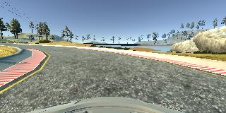
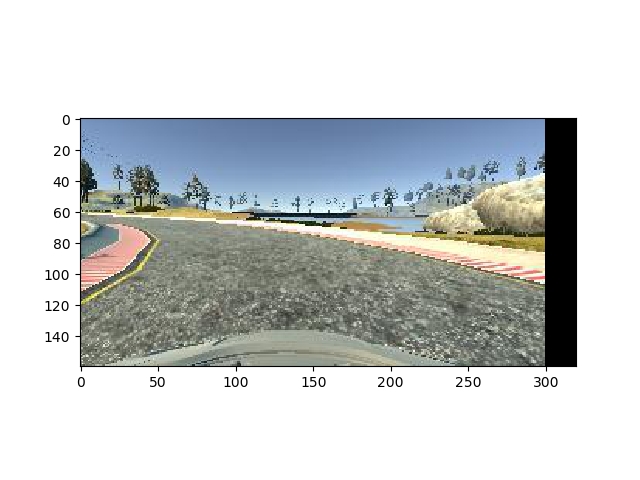
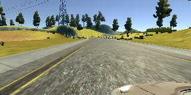
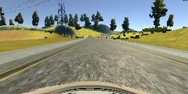
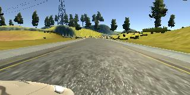
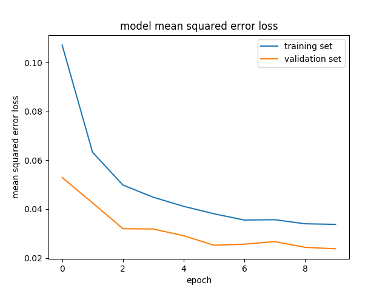
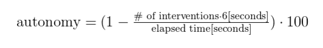

# Overview
In this project, I use the NVIDIA model and Udacity's driving emulator to create a model that clones my behavior. The goal of this model is to create a module of self-driving in which a deep neural networks can predict and control the steering angle of a car by duplicating the behavior that a person drives.

# File description
* model.py - Used to train the network.
* drive.py - Interacts with the trained model and driving emulator for testing(drive and control the steering).
* utils.py - commonly used in training and testing.
* model.h5 - the model completed learning.

# Data Recording
By using the simulator, I got the total running data for four tracks by going forward and backward for two tracks. In addition, I recorded four partial runs for the course that did not run correctly during regular driving. Since the actual steering wheel angle of the vehicle has continuity, it is completed by one mouse operation from the beginning to the end of the recording. (Left mouse button down is the start of the steering, and the up is end of the steering operation. It shows steering is zero )

Track 1 dataset - 12800

Track 2 dataset - 15000

For training whole dataset is used 8:2 ratio. 8 is training, and 2 is validation.

# Ground True
As a result of completing the drive in the emulator, I found that I drive at the exact center of gravity and not at all. As a result, the learned model works with similar biases, and it can be calibrated through parallel translation to get a model running in the middle. Unfortunately, I could not record consistent driving while recording mountain roads. In joining the two roads, the Ground True calibration value returned to neutral and the car was biased to the left or right. I think this test result say how important the quality data is in Deep Learning. If I were driving on a mountain trail using a real car, I would have come up with a consistent misdirection that I think could use more sophisticated ground truths.

* record origin

* shift correction

# preprocessing
Images input with RGB are converted to YUV.

# Data Augment
I can get three camera angles when I record images by running the emulator. As a result of observing the data stored in the angles of the three cameras, it was found that the angle deviation between the camera and the left and right cameras was very close to 0.2. In learning, a random camera image is selected to input a richer data.

## Three camera images when the steering angle is 0.2
* left

* center

* right

Therefore I can use left and right camera image with -0.2(for right) or +0.2(for left) steering angle for data augmentation.

I experimented with various ratios such as 1:1:1 and 3: 3: 1 ratio of images of three cameras, and finally I chose 1: 1: 1.
The reason is that the higher the learning frequency of the left and right camera image, the car moves to the left and right more, but the tendency to recall to the center. However, in the case of 1:1:1, it is slightly off the center of the road, but it travels very small in size moving left and right. It is also important to run to the center of the lane, but I think it is more comfortable for passengers to feel straight ahead than to move the car repeatedly from side to side.

---
# Network design
This network is based on Nvidia's network of end-to-end for self-driving cars.

## Input Layer
Input Layer receive 160x320x3 YUV images. For normalization, converts 0 to 255 from -1 to 1 in the lambda function.

## Cropping Layer
Crop the image for the conv layer. The reason for choosing crop instead of resize is that it is advantageous when the image is transformed into an edge. ( such as horizontal shift, rotate, or Etc. )

## Conv Layer
It consists of three layers with 2x2 strides in the 5x5 kernel and two layers with none stride(in other words 1x1 stride) in the 3x3 kernel. Elu is used to get nonlinearity which is more faster than Relu.

## Dropout
Add a Dropout layer to prevent overfitting.

## Flatten and Dense
Add Flatten and 4 Dense Layers to calculate final Steer values, and also elu is used to get nonlinearity.

## Overall Model network
| Layer (type)                 |Output Shape      |Params  |
|------------------------------|--------------------|-------:|
|lambda_1 (Lambda)             |(None, 160, 320, 3) |0      |
|cropping2d_1 (Cropping2D)     |(None, 66, 200, 3)  |0       |
|conv2d_1 (Conv2D)             |(None, 31, 98, 24)  |1824    |
|conv2d_2 (Conv2D)             |(None, 14, 47, 36)  |21636   |
|conv2d_3 (Conv2D)             |(None, 5, 22, 48)   |43248   |
|conv2d_4 (Conv2D)             |(None, 3, 20, 64)   |27712   |
|conv2d_5 (Conv2D)             |(None, 1, 18, 64)   |36928   |
|dropout_1 (Dropout)           |(None, 1, 18, 64)   |0       |
|flatten_1 (Flatten)           |(None, 1152)        |0       |
|dense_1 (Dense)               |(None, 100)         |115300  |
|dense_2 (Dense)               |(None, 50)          |5050    |
|dense_3 (Dense)               |(None, 10)          |510     |
|dense_4 (Dense)               |(None, 1)           |11      |
|Total Trainable params || 252,219.0|

## Training and Validation loss graph

# Result
## Around the Lake
[YouTube Link - Around the Lake](https://youtu.be/nElWD7sx5nw)

The model can be driven without leaving the road around the lake.

## Two-lane road in the mountains
[YouTube Link - Two-lane road in the mountains](https://youtu.be/-EaMyJKemwE)

This model runs in the right lane, keeping the right lane. However, four courses required human intervention, which was not perfect.
Four courses can be seen in the video, timestamps are nearby 0:37, 1:30, 2:18, 3:04.

according to autonomy fomula from NVIDIA model paper,

The model's autonomy is 90.5% = (1 - 4*6/253)*100

# References
- NVIDIA model: https://devblogs.nvidia.com/parallelforall/deep-learning-self-driving-cars/
- Udacity Self-Driving Car Simulator: https://github.com/udacity/self-driving-car-sim

